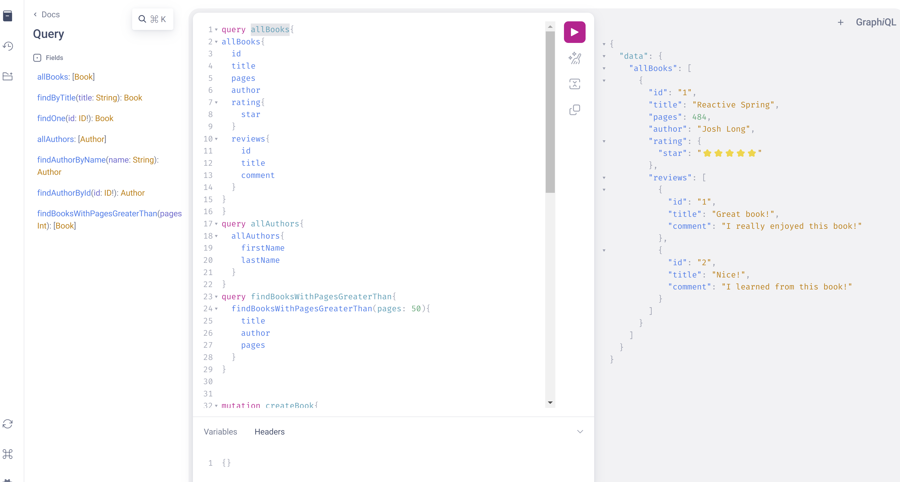
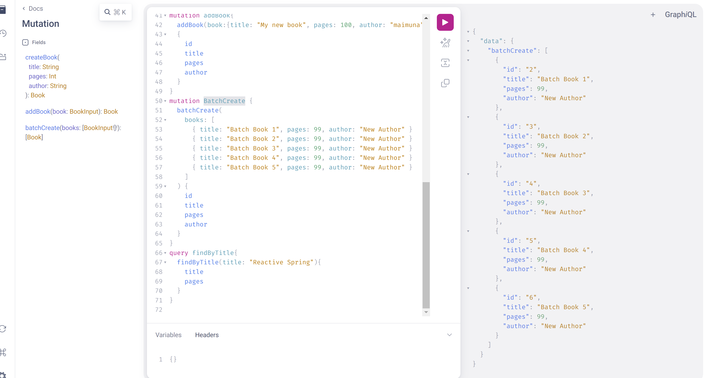
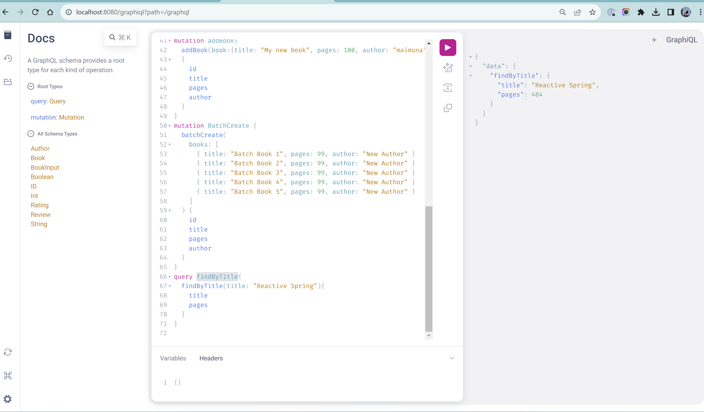
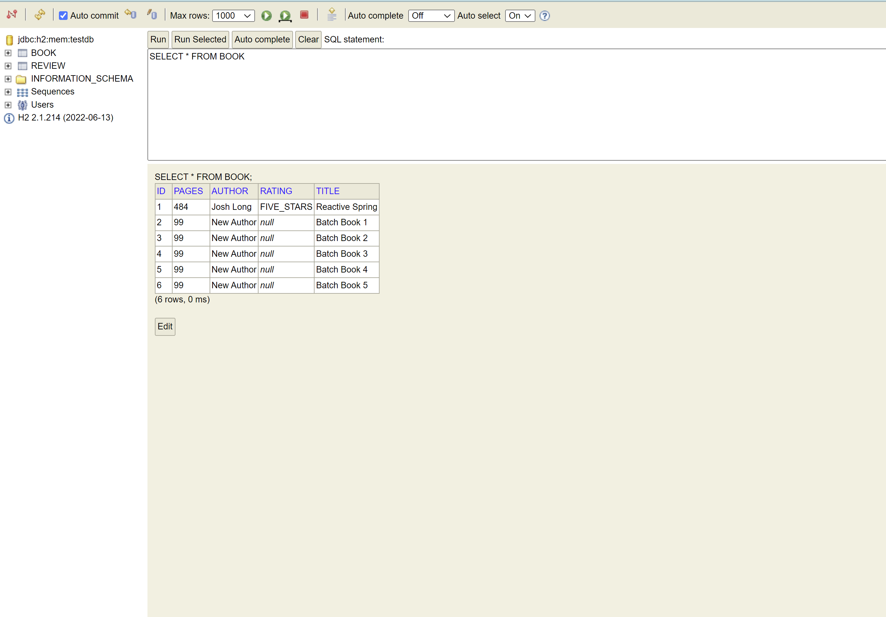
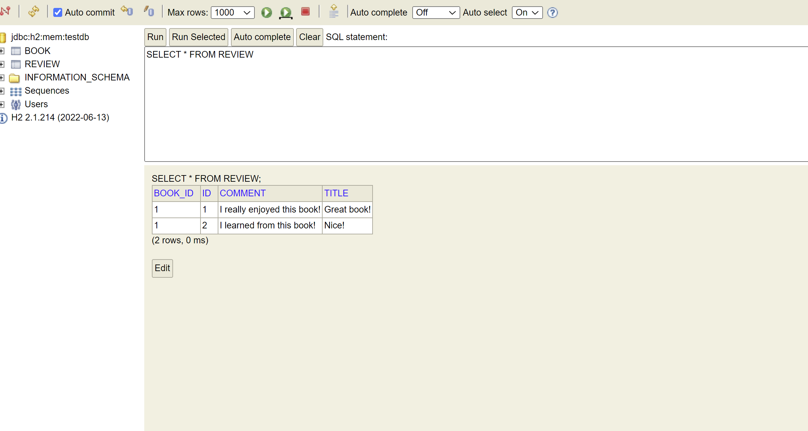

### Graphiql Link
http://localhost:8080/graphiql?path=/graphql

### List of queries
```
allBooks: [Book]
findByTitle(title: String): Book
findOne(id: ID!): Book
allAuthors: [Author]
findAuthorByName(name: String): Author
findAuthorById(id: ID!): Author
findBooksWithPagesGreaterThan(pages: Int): [Book]
```

### List of mutations
```
createBook(
title: String
pages: Int
author: String
): Book
addBook(book: BookInput): Book
batchCreate(books: [BookInput!]!): [Book]
```

### Sample Queries & Mutations
```
query allBooks{
allBooks{
id
title
pages
author
rating{
star
}
reviews{
id
title
comment
}
}
}

query allAuthors{
allAuthors{
firstName
lastName
}
}

query findBooksWithPagesGreaterThan{
findBooksWithPagesGreaterThan(pages: 50){
title
author
pages
}
}

mutation createBook{
createBook(title: "My new book", pages: 120, author: "maimuna"){
id
title
pages
author
}
}

mutation addBook{
addBook(book:{title: "My new book", pages: 100, author: "maimuna"})
{
id
title
pages
author
}
}

mutation BatchCreate {
batchCreate(
books: [
{ title: "Batch Book 1", pages: 99, author: "New Author" }
{ title: "Batch Book 2", pages: 99, author: "New Author" }
{ title: "Batch Book 3", pages: 99, author: "New Author" }
{ title: "Batch Book 4", pages: 99, author: "New Author" }
{ title: "Batch Book 5", pages: 99, author: "New Author" }
]
) {
id
title
pages
author
}
}

query findByTitle{
findByTitle(title: "Reactive Spring"){
title
pages
}
}
```
### Screenshot of allBooks query



### Screenshot of BatchCreate mutation



### Screenshot of findByTitle query



### H2 Book table screenshot


### Review table screenshot
